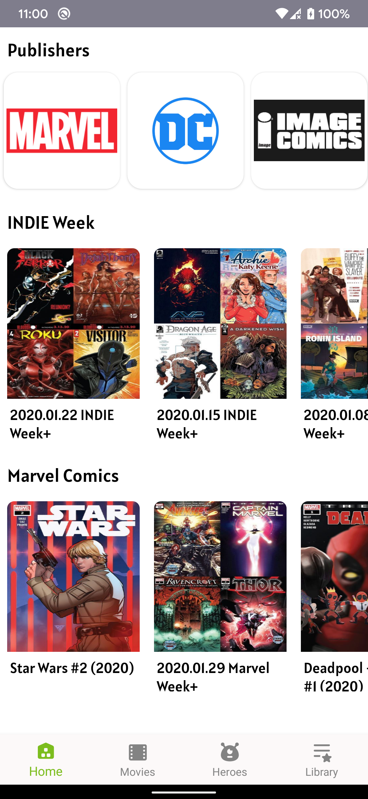

# HeroesFandom
Project for super heroes fan (show heroes and movies in one place)

## Features

- Specific data of Heores from multiverse
- Sci-fi movies
- Comic for marvel and DC (coming soon)
- Save for later
- Suggestion (coming soon)

## Tech stacks

- Kotlin
- RxJava
- Room
- FragNav (for fragment transaction)
- Jsoup (for parsing HTML document)
- LiveData
- Glide
- Retrofit
- Dagger 2
- Timber (for logging)
- Roboelectric (in development)

### Screenshots

  
  
  

